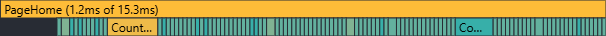
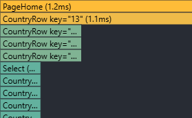
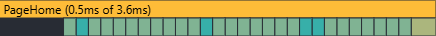
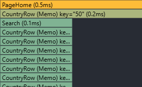

# Countries
## Performance Profiling

1. **Initial Profiling with React Dev Tools Profiler**

- Actions: filter by Europe, then sort by population
- Render: 15.3ms
- Layout effects: 0.1ms
- Passive effects: 0.1ms

2. **Updated with  React.memo and useMemo**

- Actions: filter by Europe, then sort by population
- Render: 3.6ms
- Layout effects: 0.1ms
- Passive effects: 0.1ms

